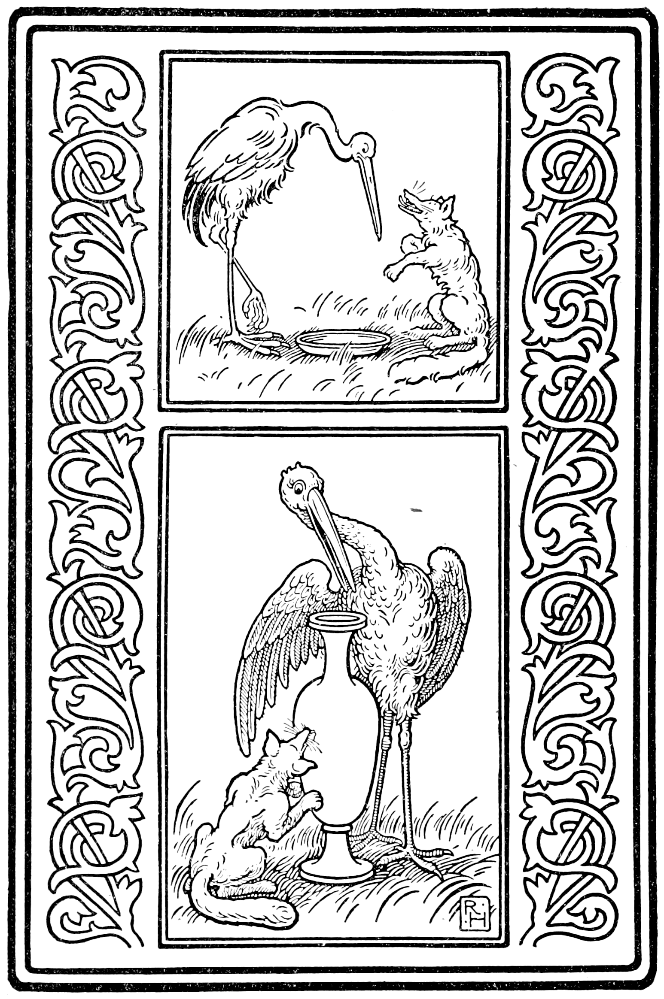

# Aesop a tháinig go h-Éirinn
A public domain version of Aesop's Fables in Irish.

ÆSOP’S FABLES IN IRISH—PARTS I. to V.

By The Rev. Peter O'Leary, P. P.
## Contents

AESOP

A ṪÁINIG GO H-ÉIRINN.

Cuid I.

Gréagach dob’ eaḋ Aesop. Rugadh é tímpal sé cheud bliadhain roimh Chríost. Daor dob’ eadh é. Do mhair sé le línn Sólóin, an t-ollamh dlíghe ba mhó d’á raibh ar Ghreugaibh. D’ínseadh sé na Fabhail mar sholuídí, chum cómhairle a leasa thabhairt do ríghthibh agus do chómhachtaibh na h-aimsire sin. Táid na Fabhail cheudna d’á n-ínsint ó shoin anuas i dteangthachaibh agus i n-urlabhraibh an domhain. Táthar ’ghá n-ínsint anois anso i nGaoluing bhreaġ bhlasta bhínn.

[1. — AN FROG AGUS AN MADRA RUA](chapters/ch1.html)

[AN COILEACH AGUS AN MADA RUADH](chapters/ch2.html)

[An Giorfhiadh agus an Gealún](chapters/ch3.html)

[An Ḟuiseóg agus a h-Ál](chapters/ch4.html)

[An t-Asal agus an Bia](chapters/ch5.html)

[Na Machtírí agus na Caoíre](chapters/ch6.html)

[An León agus na Cheithre Tairbh](chapters/ch7.html)

## Aim
Take Peadar Ua Laoghaire translation of Aesiop's Fables to Irish and convert it to modern orthography. Modern spelling. Modern word usage where needed. Create Audio Files of it. And have similar English translation for it as well. 

## Links
[Wikisource of the book](https://wikisource.org/wiki/Aesop_a_th%C3%A1inig_go_h-%C3%89irinn/An_Frog_agus_an_Mada_Rua)

[Audio for 8 stories](https://corkirish.wordpress.com/audio-files-on-this-site/)
[Youtube of more stories](https://www.youtube.com/watch?v=zyi70tG68UM&t=1s) by John Farrell
## Tasks

Story | Have Text | Orthography | Spelling | Words | Audio | English | Words checked 
--- | --- | --- | --- |--- |--- |--- |--- 
An Frog agus an Mada Rua | Y | N | N | N | N | N | N 
An Coileach agus an Mada Rua | Y | N | N | N | N | N | N  
An Giorfhiadh agus an Gealún | Y | N | N | N | N | N | N 
An Ḟuiseóg agus a h-Ál | Y | N | N | N | N | N | N 
An t-Asal agus an Bia | Y | N | N | N | N | N | N 
Na Machtírí agus na Caoíre  | Y | N | N | N | N | N | N 
An León agus na Cheithre Tairbh | N | N | N | N | N | N | N 
Na Frogana a’ Lorg Rígh
An Mac agus a Mháthair
An Mada Ruadh sa Tobar
An t-Aṫair Níṁe agus an Portán
An Sealgaire agus an Colúr
An Fear agus a Chlann Mhac
An t-Aodhre agus an Fharge
An Machtíre i gCroicean na Caorach
An Machtíre agus an t-Uan agus an Gabhar
An Luch Tuatha agus Luch an Bhaile Mhóir
An Fhiolar agus an Mada Ruadh
An Frog agus an Luch
An Dá Fhrog
An León, an Beithir, a’s an Mada Ruadh
Geallamhna an Fhir Bhreóite
An Capal agus an t-Asal
An Cromán agus na Colúra
Iupiter agus an Bheach
An Ghráinneóg agus na h-Aithreacha Nimhe
An Sean Phoc agus an Laogh
An León agus an Machtíre agus an Mada Ruadh
An Mada Ruadh agus an Machtíre
Na Giorfhithe agus na Frogana agus an Ghaoith
Bean na Circe
An Áinle agus na h-Éin Eile
An Sgiathán Leathair agus an Eas
An Príochán agus an Chaora
An Sean Duine agus an Bás
An Corcán agus an Crúsca
An tSaint agus an Formad
Fuar agus Teith
An Cat agus an t-Óigfhear
An t-Úcaire agus an Gualadóir
An Gadhar agus an Machtíre
An Capal agus an Fiadh 
An t-Iasgaire agus an Ceól 
Cogar an Bheithir 
An Mada Ruadh Maol
Ciall Cheanaig
An Príochán agus an Crúsca
An Sliabh i dTeinneas
An Dórnán Slat
An tSeilg

## Conversion code
[Convertion Code](convert.py)
